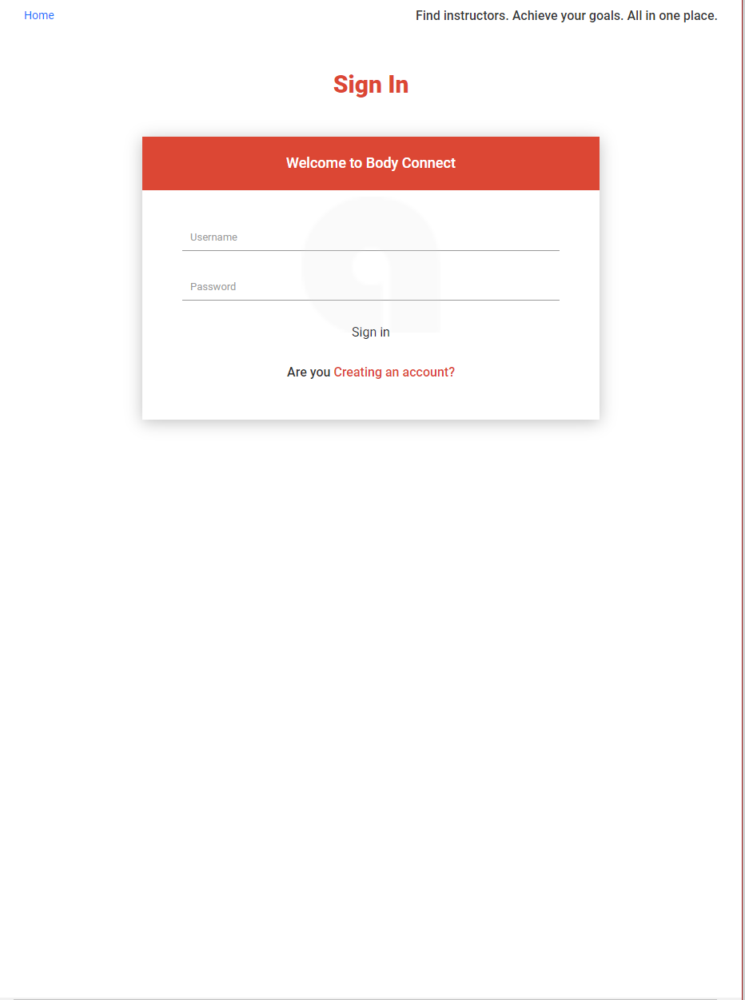
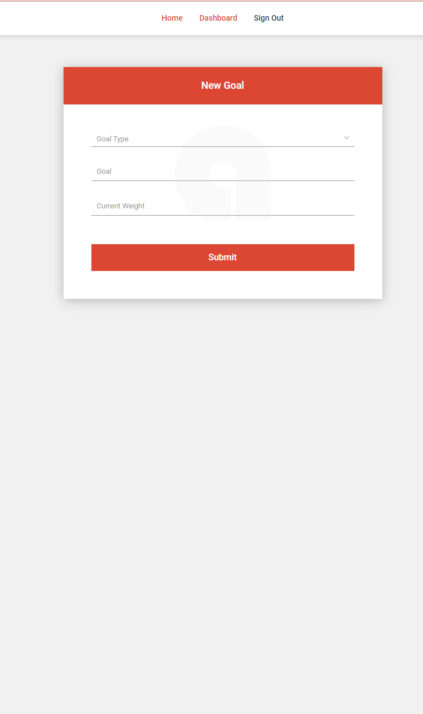

# <Book-Fitness>
## Description
We wanted to create an app that will give independent instructors and anyone in the wellness industry a better and easier way to connect with their clients without the need of using other methods of communication; as well as giving more freedoms to change their site to whatever they like, i.e adding their own scheduling apps. The past 5 days have been a massive learning experience. If we had more time than the 5 day sprint we had in class, we believe we could have depolyed a greater, more polished app for demonstrations.
- 
github https://github.com/rEEEEEahn/sci-fi-soldiers
heroku https://book-fitness.herokuapp.com/
## Table of Contents (Optional)
If your README is long, add a table of contents to make it easy for users to find what they need.
- [Installation](#installation)
- [Usage](#usage)
- [Credits](#credits)
- [License](#license)
## Installation
1. download repo from github link.
2. install neccessary dependencies and seed data
3. npm start and create your account.

## Usage
   Sign or create an account
    ```
    
    
    
   
    
## Credits
- Mike https://github.com/michael-orr
- Justin https://github.com/stan1651
- Ryan https://github.com/rEEEEEahn/sci-fi-soldiers
- Calendly https://calendly.com/
- Node.js , Express.js, Handlebars.js, MySQL & Sequelize

## License
MIT License

Copyright (c) [2021] [SciFi-Soldiers]

Permission is hereby granted, free of charge, to any person obtaining a copy
of this software and associated documentation files (the "Software"), to deal
in the Software without restriction, including without limitation the rights
to use, copy, modify, merge, publish, distribute, sublicense, and/or sell
copies of the Software, and to permit persons to whom the Software is
furnished to do so, subject to the following conditions:

The above copyright notice and this permission notice shall be included in all
copies or substantial portions of the Software.

THE SOFTWARE IS PROVIDED "AS IS", WITHOUT WARRANTY OF ANY KIND, EXPRESS OR
IMPLIED, INCLUDING BUT NOT LIMITED TO THE WARRANTIES OF MERCHANTABILITY,
FITNESS FOR A PARTICULAR PURPOSE AND NONINFRINGEMENT. IN NO EVENT SHALL THE
AUTHORS OR COPYRIGHT HOLDERS BE LIABLE FOR ANY CLAIM, DAMAGES OR OTHER
LIABILITY, WHETHER IN AN ACTION OF CONTRACT, TORT OR OTHERWISE, ARISING FROM,
OUT OF OR IN CONNECTION WITH THE SOFTWARE OR THE USE OR OTHER DEALINGS IN THE
SOFTWARE.

## Features
- Create goals and share them with your professional
- Professional can see and comment on clients' goals
- see list of professionals


